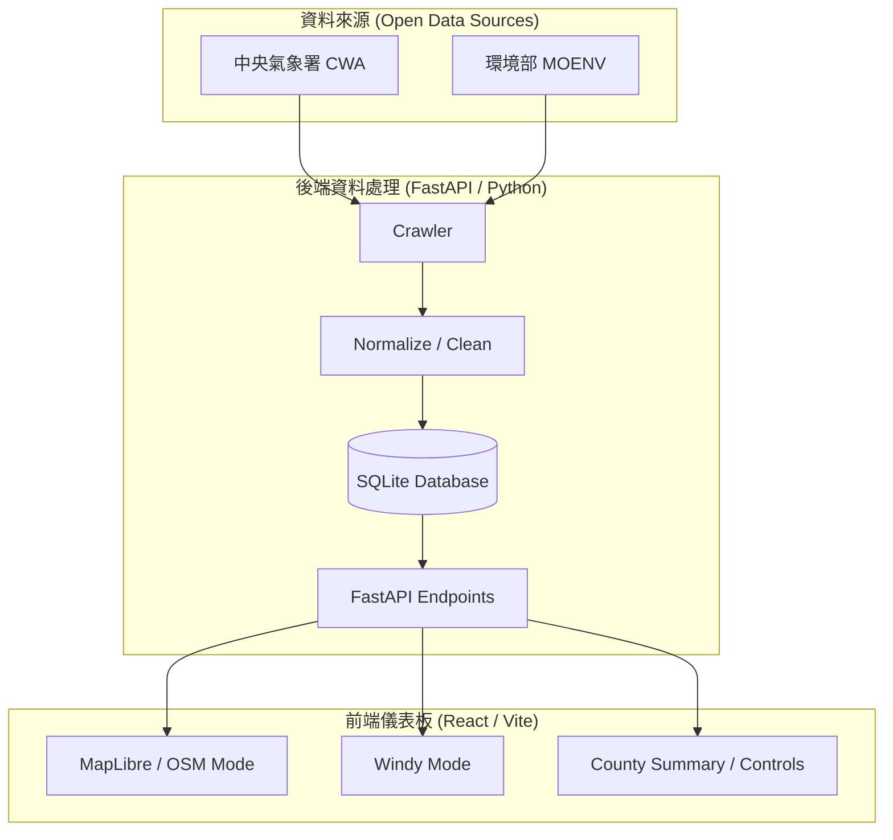

# 台灣環境觀測資料視覺化平台

(Taiwan Environmental Observation Dashboard)

<p align="center">
  
  
  
  
  
</p>

💡 **本專案旨在整合台灣政府開放資料與地圖服務，將氣候、空氣品質與環境觀測資料轉換為可互動的視覺化儀表板。**

透過後端資料擷取與正規化流程，平台將不同來源的開放 API 資料整理成一致格式，並以前端地圖介面呈現各地測站狀態、指標分布與區域差異。使用者可透過指標切換、縣市篩選與門檻控制，快速掌握台灣各地環境觀測資訊。

🔗 [**Live Demo**](https://cwa-weather-crawler.vercel.app/)

---

## 🎯 專案核心定位與特色

本專案定位為**台灣環境觀測資料的整合型視覺化平台**。目前以政府開放 API 為主要資料來源，並保留後續擴充更多環境指標與分析模組的彈性。

1. **整合政府開放資料**：
   後端串接中央氣象署與環境部開放 API，將不同來源的觀測資料清洗、標準化並存入資料庫，避免前端直接處理不一致的原始資料格式。

2. **互動式地圖呈現**：
   前端提供地圖化儀表板，讓使用者能以直覺方式查看不同地區的觀測狀態，並透過縣市、指標與門檻篩選快速聚焦重點區域。

3. **雙地圖模式設計**：
   OSM 模式以 OpenStreetMap / MapLibre 呈現測站與統計資料；Windy 模式則提供風場背景，並疊加相同的觀測指標圓點，讓兩種模式維持一致操作邏輯。

4. **可擴充的資料處理流程**：
   crawler、normalization、repository 與 API layer 分開設計，後續可逐步加入 UV、AQI、PM10、O3、NO2、SO2、CO 或其他環境資料。

---

## 🏗️ 系統架構與資料流



---

## 📂 目錄結構與模組說明

```text
├── api/                         # FastAPI endpoints
├── crawler/                     # CWA / MOENV API clients and data normalization
├── database/                    # SQLite connection, schema and initialization
├── data/                        # Local runtime data, ignored by git
├── docs/                        # Planning and cloud deployment notes
├── frontend/                    # React / Vite frontend dashboard
└── scripts/                     # CLI scripts for crawler, init and validation
```

---

## 📊 資料來源與視覺化模式

| 類別 | Dataset / 服務 | 用途 |
| --- | --- | --- |
| 中央氣象署 CWA | `O-A0003-001` | 氣象觀測資料 |
| 環境部 MOENV | `aqx_p_432` | 空氣品質觀測資料 |
| OpenStreetMap | Map tiles | OSM 模式地圖底圖 |
| Windy | Map Forecast API | Windy 模式風場背景 |

---

## 🔑 API Key 與環境變數

本專案需要 CWA、MOENV 與 Windy API key。

- `CWA_API_KEY` 與 `MOENV_API_KEY` 僅供後端使用。
- `VITE_WINDY_API_KEY` 供前端載入 Windy Map Forecast API。
- 若前後端分離部署，`VITE_API_BASE_URL` 需設定為後端服務網址。

複製環境變數範例檔：

```powershell
copy .env.example .env
```

`.env.example`：

```env
# Frontend
VITE_API_BASE_URL=
VITE_WINDY_API_KEY=your_windy_map_forecast_key_here

# Backend
CWA_API_KEY=your_cwa_api_key_here
CWA_DATASET_ID=F-D0047-091
CWA_OBSERVATION_DATASET_ID=O-A0003-001
MOENV_API_KEY=your_moenv_api_key_here
MOENV_PM25_DATASET_ID=aqx_p_432
DATABASE_PATH=data/weather.db
RAW_DATA_DIR=data/raw
```

---

## 🚀 部署與本地開發

### 1. 安裝後端環境

```powershell
py -m venv .venv
.\.venv\Scripts\activate
pip install -r requirements.txt
```

### 2. 初始化資料庫與觀測資料

```powershell
py scripts/init_db.py
py scripts/run_weather_observations.py
py scripts/run_pm25.py
```

### 3. 啟動 FastAPI 後端

```powershell
uvicorn api.main:app --reload
```

### 4. 啟動前端開發服務

```powershell
cd frontend
npm install
npm run dev
```

啟動後可於瀏覽器開啟 Vite 顯示的 localhost 網址進行預覽。

---

## 📡 API Endpoints

| Endpoint | Method | 說明 |
| --- | --- | --- |
| `/api/health` | GET | 服務狀態與最新同步資訊 |
| `/api/weather/stations.geojson` | GET | CWA 測站觀測資料 GeoJSON |
| `/api/pm25/latest` | GET | 最新空氣品質觀測資料 |
| `/api/summary/counties` | GET | 縣市層級摘要資料 |
| `/api/refresh/weather` | POST | 更新 CWA 氣象觀測資料 |
| `/api/refresh/pm25` | POST | 更新 MOENV 空氣品質資料 |

---

## ☁️ 雲端部署

目前 MVP 採用前後端分離部署：

| 層級 | 平台 | 重點設定 |
| --- | --- | --- |
| 前端 | Vercel | `VITE_API_BASE_URL`, `VITE_WINDY_API_KEY` |
| 後端 | Render | CWA / MOENV API key, SQLite persistent path |
| 資料庫 | Render Persistent Disk | `weather.db` 與 raw snapshot |
| 排程 | GitHub Actions 或 cron service | 定期呼叫 refresh endpoints |

完整部署流程請參考 [docs/cloud_deployment.md](docs/cloud_deployment.md)。

---

## 🧭 未來發展

- 擴充 UV、AQI、PM10、O3、NO2、SO2、CO 等環境觀測指標。
- 建立高溫、強風、強降雨、高 UV 與空氣品質不良等警示條件。
- 累積歷史資料後，加入縣市趨勢、時間序列比較與異常觀測提示。
- 增加後台管理介面，讓資料更新與排程狀態更容易被維護。
- 強化不同縣市、測站與時間區間之間的視覺化比較。

---

## 📝 開發收穫

- 地圖視覺化與資料真相來源需要分離；Windy 適合作為風場背景，測站數值、摘要與排名仍應由後端正規化資料提供。
- 政府開放資料常見缺值與 sentinel value，例如 `-99`、`-999`，需要在後端清理後再交給前端呈現。
- 環境觀測資料應明確區分 `observed_at` 與 `fetched_at`，避免使用者誤解資料新鮮度。
- OSM 與 Windy 模式應共用相同的指標、篩選條件、門檻與圖例，降低使用者操作成本。
- README、`.env.example` 與部署文件需要和實際功能同步，尤其是前後端分離時的環境變數設定與 API key 使用邊界。
