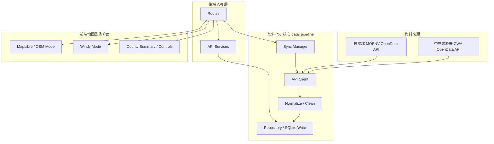

# CWA-GeoMap_Monitor

(Taiwan CWA OpenData API GeoMap Monitor)

<p align="center">
  
  
  
  
  
</p>

💡 **本專案旨在透過中央氣象署與相關政府開放 API，建立一套以地圖為核心的台灣環境觀測監測與視覺化應用。**

專案透過 OpenData API 呼叫取得觀測資料，經由後端清洗、正規化與儲存後，再以前端 GeoMap 介面呈現測站分布、觀測指標、縣市差異與環境狀態。

🔗 [**Live Demo**](https://cwa-weather-crawler.vercel.app/)

---

## 🎯 專案核心定位與特色

本專案定位為 **CWA OpenData API 的地圖監測與視覺化應用**。CWA 是主要資料核心，環境部資料則作為空氣品質觀測的延伸整合。

1. **OpenData API 呼叫應用**：後端透過中央氣象署與環境部開放 API 取得觀測資料，並整理為前端可直接使用的統一資料結構。
2. **GeoMap 地圖監測介面**：前端以地圖作為主要互動入口，讓使用者能直接從地理分布理解各地測站狀態。
3. **雙地圖模式設計**：OSM 模式以 OpenStreetMap / MapLibre 呈現測站資料；Windy 模式提供風場背景並疊加觀測指標圓點。
4. **可擴充的觀測資料流程**：API client、normalization、repository、sync manager 與 FastAPI route layer 分開設計，方便後續加入更多環境觀測資料。

---

## 🏗️ 系統架構與資料流



---

## 📂 目錄結構與模組說明

```text
├── api/                         # FastAPI HTTP layer
│   ├── main.py                   # App bootstrap, CORS and router registration
│   ├── routes/                   # HTTP endpoints grouped by domain
│   └── services/                 # Query, summary and GeoJSON services for API routes
├── data_pipeline/                # CWA / MOENV API clients, data sync and normalization
│   ├── service.py                # Single-source sync functions
│   ├── sync_manager.py           # Multi-source sync entry point and future concurrency layer
│   ├── cwa_client.py             # CWA OpenData API client
│   ├── moenv_client.py           # MOENV OpenData API client
│   ├── normalize.py              # Raw API response normalization
│   └── repository.py             # Raw snapshots, DB write and fetch logs
├── database/                     # SQLite connection, schema and initialization
├── data/                         # Local runtime data, ignored by git
├── docs/                         # Planning and cloud deployment notes
├── frontend/                     # React / Vite GeoMap monitor frontend
└── scripts/                      # CLI scripts for API sync, init and validation
```

---

## 🧩 後端責任邊界

| Layer | 主要職責 | 不負責 |
| --- | --- | --- |
| `scripts/` | 本機、部署或排程使用的命令列入口 | 不直接寫 API 呼叫、資料清洗或 DB 寫入邏輯 |
| `api/routes/` | 接收 HTTP request，回傳 response，處理 endpoint grouping | 不直接寫複雜資料同步或統計邏輯 |
| `api/services/` | 提供 API 所需的查詢、摘要、GeoJSON 組裝 | 不處理外部 OpenData API 同步 |
| `data_pipeline/` | 外部 API client、資料清洗、同步流程、寫入資料庫 | 不處理 HTTP routing 或 CLI 互動 |

---

## 📊 資料來源與視覺化模式

| 類別 | Dataset / 服務 | 用途 |
| --- | --- | --- |
| 中央氣象署 CWA | `O-A0003-001` | 氣象觀測資料 |
| 環境部 MOENV | `aqx_p_432` | 空氣品質觀測資料 |
| OpenStreetMap | Map tiles | OSM 模式地圖底圖 |
| Windy | Map Forecast API | Windy 模式風場背景 |

---

## ⚡ 資料載入與效能設計

本專案目前沒有自行實作 Python 多執行緒或 multiprocessing。後端資料同步採用明確的 API client 流程，分別呼叫 CWA 與 MOENV OpenData API，完成資料清洗後寫入 SQLite。

前端載入採用瀏覽器端並行請求設計：首頁會同時取得縣市摘要、CWA GeoJSON 測站資料、PM2.5 觀測資料與健康檢查資訊，避免多個 API 依序等待而拉長 loading 時間。

後端已新增 `data_pipeline/sync_manager.py` 作為多資料源同步入口。目前 SQLite-backed MVP 仍以循序寫入為主，避免多個 writer 同時寫入造成 database lock。若未來改用 PostgreSQL，或將 fetch / normalize / write 三個階段拆開，`sync_manager.py` 會是導入 `ThreadPoolExecutor`、`asyncio + httpx.AsyncClient` 或背景任務佇列的主要位置。

---

## 🔑 環境變數

本專案需要 CWA、MOENV 與 Windy 的環境變數設定。實際變數名稱與範例請參考 `.env.example`，正式部署時請在後端平台與前端平台分別設定。

---

## 🚀 部署與本地開發

```powershell
py -m venv .venv
.\.venv\Scripts\activate
pip install -r requirements.txt
py scripts/init_db.py
py scripts/run_weather_observations.py
py scripts/run_pm25.py
uvicorn api.main:app --reload
```

前端：

```powershell
cd frontend
npm install
npm run dev
```

---

## 📡 API Endpoints

| Endpoint | Method | 說明 |
| --- | --- | --- |
| `/api/health` | GET | 服務狀態與最新同步資訊 |
| `/api/weather/stations.geojson` | GET | CWA 測站觀測資料 GeoJSON |
| `/api/pm25/latest` | GET | 最新空氣品質觀測資料 |
| `/api/summary/counties` | GET | 縣市層級摘要資料 |
| `/api/refresh/weather` | POST | 更新 CWA 氣象觀測資料 |
| `/api/refresh/pm25` | POST | 更新 MOENV 空氣品質資料 |
| `/api/refresh/observations` | POST | 透過 sync manager 更新主要觀測資料來源 |
| `/api/refresh/all` | POST | 透過 sync manager 更新 forecast、weather 與 PM2.5 |

---

## 🧭 未來發展

- 擴充 UV、AQI、PM10、O3、NO2、SO2、CO 等環境觀測指標。
- 建立高溫、強風、強降雨、高 UV 與空氣品質不良等警示條件。
- 累積歷史資料後，加入縣市趨勢、時間序列比較與異常觀測提示。
- 強化不同縣市、測站與時間區間之間的 GeoMap 視覺化比較。

---

## 📝 開發收穫

- 地圖視覺化與資料真相來源需要分離；Windy 適合作為風場背景，測站數值、摘要與排名仍應由後端正規化資料提供。
- 政府開放資料常見缺值與 sentinel value，例如 `-99`、`-999`，需要在後端清理後再交給前端呈現。
- 環境觀測資料應明確區分 `observed_at` 與 `fetched_at`，避免使用者誤解資料新鮮度。
- OSM 與 Windy 模式應共用相同的指標、篩選條件、門檻與圖例，降低使用者操作成本。
- README、`.env.example` 與部署文件需要和實際功能同步，尤其是前後端分離時的環境變數設定與 API 使用邊界。
