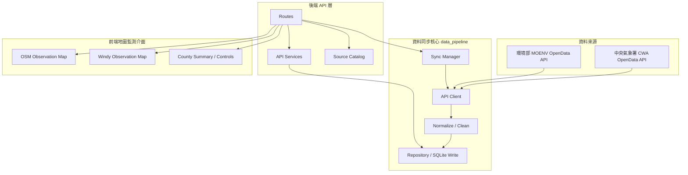

# CWA-GeoMap_Monitor

(Taiwan CWA OpenData API GeoMap Monitor)

<p align="center">
  
  
  
  
  
</p>

💡 **本專案旨在透過中央氣象署與其他政府機關提供的 OpenData API，建立一個基於國家地圖的環境監測與視覺化應用的網站。**

專案透過 OpenData API 呼叫取得觀測資料，經由後端清洗、正規化與儲存後，再以前端 GeoMap 介面呈現測站分布、觀測指標、縣市差異與環境狀態。

🔗 [**Live Demo**](https://cwa-weather-crawler.vercel.app/)

---

## 🎯 專案核心定位與特色

本專案定位為 **CWA OpenData API 的地圖監測與視覺化應用**。CWA 是主要氣象資料核心，環境部資料則作為空氣品質觀測延伸整合。

1. **OpenData API 呼叫應用**：後端透過中央氣象署與環境部開放 API 取得觀測資料，整理為前端可直接使用的統一資料結構。
2. **GeoMap 地圖監測介面**：前端以地圖作為主要互動入口，讓使用者能直接從地理分布理解各地測站狀態。
3. **空汙 / 氣象指標整合**：目前支援氣溫、近10分降雨、近24時降雨、濕度、風速、能見度、PM2.5 與多項空氣污染物觀測。
4. **雙地圖視覺化設計**：OSM 底圖提供清楚的測站分布視角；Windy 提供風場背景並疊加同一組觀測指標圓點。
5. **可擴充的觀測資料流程**：API client、normalization、repository、sync manager 與 FastAPI route layer 分開設計，方便後續加入雨量、地震、日出日落與警特報資料。

---

## 🏗️ 系統架構與資料流



---

## 📂 目錄結構與模組說明

```text
├── api/                         # FastAPI HTTP layer
│   ├── main.py                   # App bootstrap, CORS and router registration
│   ├── routes/                   # HTTP endpoints grouped by domain
│   └── services/                 # Query, summary, source catalog and GeoJSON services
├── data_pipeline/                # CWA / MOENV API clients, data sync and normalization
│   ├── service.py                # Single-source sync functions
│   ├── sync_manager.py           # Multi-source sync entry point and future concurrency layer
│   ├── cwa_client.py             # CWA OpenData API client
│   ├── moenv_client.py           # MOENV OpenData API client
│   ├── normalize.py              # Raw API response normalization
│   └── repository.py             # Raw snapshots, DB write and fetch logs
├── database/                     # SQLite connection, schema, initialization and lightweight migrations
├── data/                         # Local runtime data, ignored by git
├── docs/                         # API source review, planning and deployment notes
├── frontend/                     # React / Vite GeoMap monitor frontend
└── scripts/                      # CLI scripts for API sync, init and validation
```

---

## 📊 資料來源與視覺化模式

| 類別 | Dataset / 服務 | 用途 | 目前狀態 |
| --- | --- | --- | --- |
| 中央氣象署 CWA | `O-A0003-001` | 即時氣象觀測、能見度、雨量欄位預留 | Active |
| 環境部 MOENV | `aqx_p_432` | 空品狀態、指標污染物、PM2.5、PM10、O3、CO、NO2、SO2 | Active |
| 中央氣象署 CWA | `O-A0001-001` | 自動氣象站觀測 | Candidate |
| 中央氣象署 CWA | `O-A0002-001` | 自動雨量站與累積雨量專層 | Candidate |
| 中央氣象署 CWA | `A-B0062-001` | 日出日沒 | Candidate，需要行政區或 geocode join |
| 中央氣象署 CWA | `W-C0033-001` / `W-C0033-006` | 天氣警特報與影響區域 | Candidate，需要區域 join |
| 中央氣象署 CWA | `E-A0015-001` / `E-A0016-001` | 地震報告與震度 | Candidate |

完整 API 可用性盤點請看 [`docs/API_SOURCES.md`](docs/API_SOURCES.md)。

---

## 🧮 空氣污染物指標

本專案目前不把綜合空品分數作為前端觀測指標，而是直接呈現環境部空氣品質監測資料中的污染物觀測值。這樣能讓使用者直接比較 PM2.5、PM10、O3、CO、SO2、NO2 等具體測項。

目前前端使用的空品欄位包含：`status`、`pollutant`、`pm25`、`pm25_avg`、`pm10`、`pm10_avg`、`so2`、`co`、`co_8hr`、`o3`、`o3_8hr`、`no2`、`nox`、`no`。

---

## 👁️ 能見度與累積雨量

能見度由 CWA 觀測資料的 `Visibility` 或 `VisibilityDescription` 正規化為 `visibility_km` 與 `visibility_description`，前端可直接用於地圖點位、排行與縣市摘要。

雨量目前分成 `rainfall_10min` 與 `rainfall_today`。`rainfall_10min` 只取 CWA 回傳的最近 10 分鐘雨量，不再使用 15 分鐘雨量欄位；`rainfall_today` 用於保存今日或日累積雨量。

---

## ⚡ 資料載入與效能設計

後端資料同步採用清楚分層的 API client、normalization、repository 與 sync manager 流程，讓 CWA 與 MOENV 資料可以在同一套管線中清洗、保存與對外服務。

前端首頁採用瀏覽器端並行請求設計，同時取得縣市摘要、CWA GeoJSON 測站資料、空氣品質觀測資料、健康檢查與 API source catalog，降低初次載入等待時間。

`data_pipeline/sync_manager.py` 集中管理多資料源同步入口，讓天氣、雨量、空氣污染物與未來擴充資料能維持一致的更新介面。

---

## 🔑 環境變數

本專案需要 CWA、MOENV 與 Windy 的環境變數設定。實際變數名稱與範例請參考 `.env.example`，正式部署時請在後端平台與前端平台分別設定。

---

## 🚀 部署與本地開發

```powershell
py -m venv .venv
.\.venv\Scripts\activate
pip install -r requirements.txt
py scripts/init_db.py
py scripts/run_weather_observations.py
py scripts/run_air_quality_observations.py
uvicorn api.main:app --reload
```

前端：

```powershell
cd frontend
npm install
npm run dev
```

---

## 📡 API Endpoints

| Endpoint | Method | 說明 |
| --- | --- | --- |
| `/api/health` | GET | 服務狀態與最新同步資訊 |
| `/api/data-sources` | GET | 專案使用與候選 API source catalog |
| `/api/weather/stations.geojson` | GET | CWA 測站觀測資料 GeoJSON |
| `/api/weather/latest` | GET | 最新 CWA 氣象觀測資料 |
| `/api/pm25/latest` | GET | 最新空氣品質觀測資料，保留相容舊命名 |
| `/api/air-quality/latest` | GET | 最新空氣品質觀測資料 |
| `/api/summary/counties` | GET | 縣市層級摘要資料 |
| `/api/refresh/weather` | POST | 更新 CWA 氣象觀測資料 |
| `/api/refresh/air-quality` | POST | 更新 MOENV 空氣品質資料 |
| `/api/refresh/observations` | POST | 透過 sync manager 更新主要觀測資料來源 |
| `/api/refresh/all` | POST | 透過 sync manager 更新全部已接入觀測資料來源 |

Legacy note：舊的 `/api/temperature/geojson` 已移除，現在統一使用 `/api/weather/stations.geojson`。

---

## 🧭 未來發展

- 接入 `O-A0002-001` 作為累積雨量專層。
- 接入 `E-A0015-001` / `E-A0016-001` 做地震震央與震度圖層。
- 接入 `A-B0062-001` 做日出日落資訊卡。
- 接入 `W-C0033-001` / `W-C0033-006` 做警特報區域圖層。
- 建立高溫、強風、強降雨、高 UV、低能見度與空氣品質不良等警示條件。
- 依資料量與部署平台評估非同步抓取、背景任務佇列或 PostgreSQL，提升多資料源更新效率。
- 累積歷史資料後，加入縣市趨勢、時間序列比較與異常觀測提示。

---

## 📝 開發收穫

- 地圖視覺化與資料真相來源需要分離；Windy 適合作為風場背景，測站數值、摘要與排名仍應由後端正規化資料提供。
- 空氣品質呈現應優先對齊具體污染物測項，讓使用者能直接比較 PM2.5、PM10、O3、CO、SO2、NO2 等來源值。
- 政府開放資料常見缺值與 sentinel value，例如 `-99`、`-999`，需要在後端清理後再交給前端呈現。
- 環境觀測資料應明確區分 `observed_at` 與 `fetched_at`，避免使用者誤解資料新鮮度。
- OSM 與 Windy 模式應共用相同的指標、篩選條件、門檻與圖例，降低使用者操作成本。
- README、`.env.example` 與部署文件需要和實際功能同步，尤其是前後端分離時的環境變數設定與 API 使用邊界。
